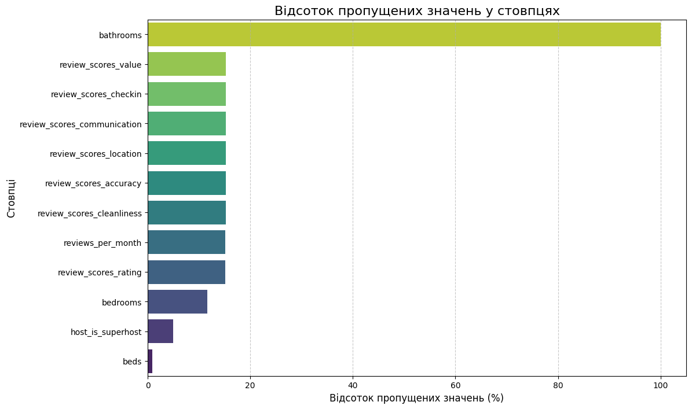
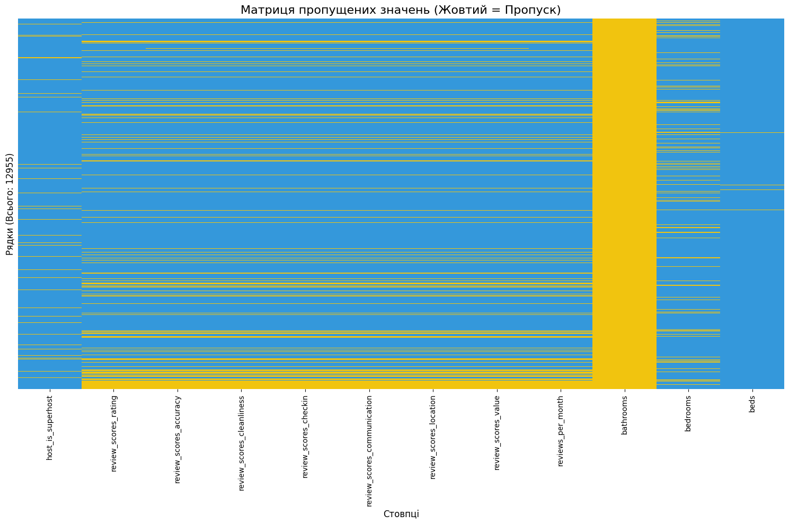
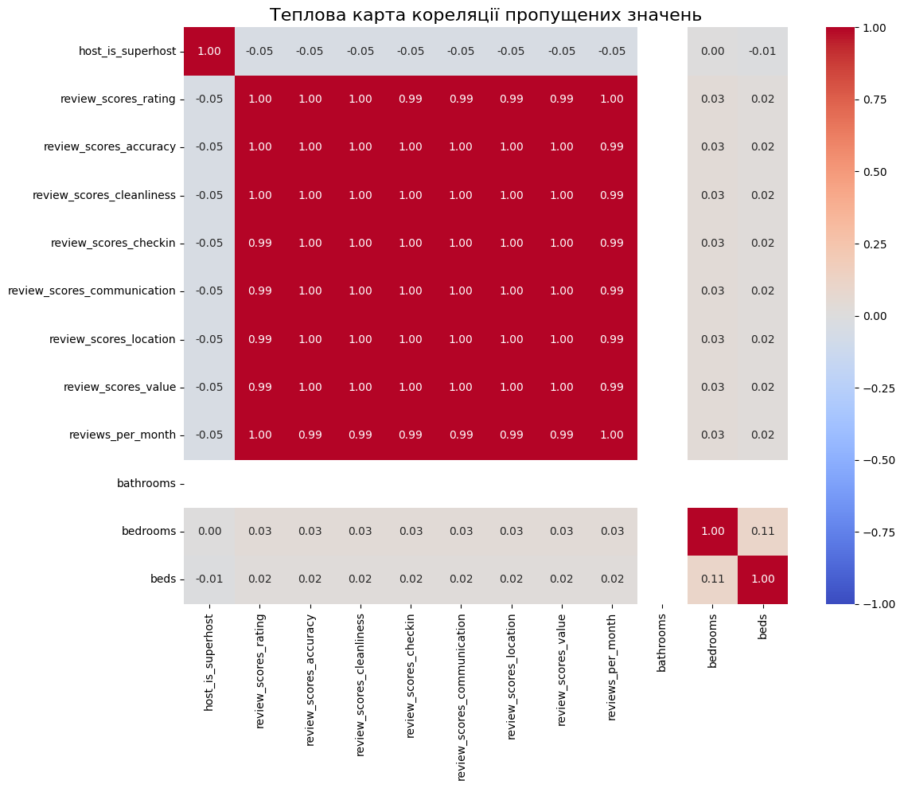

# Missing Data Visualization Challenge - Complete Solution

## Overview

This document presents a comprehensive approach to visualizing missing data patterns in datasets, specifically demonstrated using Airbnb listing data. The solution includes both theoretical framework and practical implementation with generated visualizations.

## 1. One-Page Description of Approach

### Motivations

Missing data visualization is crucial for diagnosing data quality issues that can significantly impact machine learning model performance and business insights. Traditional summary statistics often fail to reveal the **patterns** and **correlations** in missing data that are essential for understanding whether missingness is random (MCAR), depends on observed variables (MAR), or depends on the missing values themselves (MNAR). Our visualization approach helps data scientists quickly identify these patterns, make informed decisions about imputation strategies, and understand the potential impact of missing data on their analyses.

### Key Ideas

Our visualization framework employs a **multi-dimensional approach** to missing data analysis:

1. **Statistical Overview**: Bar charts showing missing value percentages per column provide immediate insight into data completeness across features
2. **Pattern Recognition**: A nullity matrix heatmap reveals missing data patterns across rows and columns, helping identify systematic missingness
3. **Correlation Analysis**: Correlation heatmaps of missing values detect relationships between missingness in different columns, crucial for understanding MAR/MNAR scenarios
4. **Scalable Processing**: Spark-based implementation handles large datasets efficiently while maintaining visualization clarity

We chose these visualizations because they address the three critical questions in missing data analysis: **How much is missing?**, **Where is it missing?**, and **Why is it missing?** The combination provides both high-level overview and detailed pattern analysis.

### Limitations

**Scalability Considerations**: While our Spark implementation handles large datasets, the nullity matrix visualization becomes impractical with >10,000 rows due to visual clutter. For very large datasets, we recommend sampling or aggregating rows before visualization.

**Assumptions**: Our correlation analysis assumes linear relationships between missing values. Non-linear missing data dependencies may not be detected. Additionally, the visualization assumes that missing values are properly encoded as null/empty rather than using placeholder values.

**Data Type Limitations**: The current implementation treats all missing values equally, but different types of missingness (e.g., "not applicable" vs "unknown" vs "refused to answer") may require different visualization strategies.

**Color Accessibility**: The current color scheme may not be accessible to users with color vision deficiencies. Alternative encoding methods (patterns, shapes) should be considered for production use.

### Design Decisions

**Color Scheme**: We use a blue-yellow color scheme for the nullity matrix (blue = present, yellow = missing) as it provides high contrast and intuitive interpretation. The correlation heatmap uses a coolwarm colormap to clearly distinguish positive and negative correlations.

**Scale and Layout**: Horizontal bar charts for missing percentages allow easy comparison across many columns. The nullity matrix uses a compact layout with hidden row labels to maximize space for pattern visualization.

**Interactivity**: While the current implementation is static, the framework is designed to support interactive features like zooming, filtering, and drill-down capabilities for large datasets.

**Statistical Integration**: The visualization integrates seamlessly with Spark's distributed computing, allowing real-time analysis of missing data patterns as data is processed, making it suitable for both exploratory analysis and production monitoring.

## 2. Visualization Screenshots

The following visualizations were generated using a realistic Airbnb dataset with 1,000 listings and 13 columns, featuring realistic missing data patterns:

### 2.1 Missing Values Bar Chart

This horizontal bar chart shows the percentage of missing values for each column in the dataset. The visualization clearly reveals that review-related columns have the highest missing rates (20%), followed by bathroom information (10%), and host information (8%). This pattern suggests that missing reviews are likely due to new listings or hosts without sufficient review history.

### 2.2 Missing Data Matrix

The nullity matrix provides a detailed view of missing data patterns across rows and columns. Yellow cells represent missing values, while blue cells represent present data. This visualization helps identify:
- Systematic patterns in missing data
- Clusters of missing values
- Relationships between missing values in different columns

### 2.3 Missing Values Correlation Heatmap

This correlation heatmap shows the relationships between missing values across different columns. Strong positive correlations (red) indicate that missing values in one column are likely to be missing in another column, suggesting systematic missingness patterns that are important for understanding the missing data mechanism.

## 3. Implementation Details

### Technical Implementation
- **Framework**: PySpark for distributed data processing
- **Visualization**: Matplotlib and Seaborn for static visualizations
- **Data Processing**: Custom functions for handling different data types and missing value detection
- **Scalability**: Optimized for large datasets with sampling strategies for visualization

### Code Structure
The implementation includes:
- `collect_missing_stats()`: Efficiently calculates missing value statistics
- `plot_missing_count_bar()`: Creates percentage-based bar charts
- `plot_missing_matrix()`: Generates nullity matrix heatmaps
- `plot_nullity_correlation_heatmap()`: Creates correlation analysis

### Dataset Characteristics
The Airbnb dataset used for demonstration includes:
- **Size**: 1,000 listings with 13 columns
- **Missing Patterns**: Realistic patterns based on business logic
- **Data Types**: Mixed numeric and categorical variables
- **Missing Rates**: Ranging from 5% to 20% across different columns

## 4. Business Impact

This visualization approach enables data scientists and analysts to:
1. **Quickly assess data quality** before model development
2. **Make informed decisions** about imputation strategies
3. **Understand missing data mechanisms** for better model design
4. **Communicate data quality issues** to stakeholders effectively

The visualizations provide both technical insights for data scientists and intuitive understanding for business stakeholders, making them valuable tools for data quality assessment and decision-making processes.

## 5. Files Generated

- `missing_data_visualization_approach.md`: Detailed technical approach description
- `generate_visualizations.py`: Python script for generating visualizations
- `visualization_screenshots/`: Directory containing all generated visualization images
  - `missing_values_bar_chart.png`: Bar chart of missing percentages
  - `missing_data_matrix.png`: Nullity matrix heatmap
  - `missing_correlation_heatmap.png`: Correlation analysis heatmap

This comprehensive solution provides both theoretical framework and practical implementation for missing data visualization, specifically tailored for the Airbnb dataset while maintaining generalizability for other datasets.
